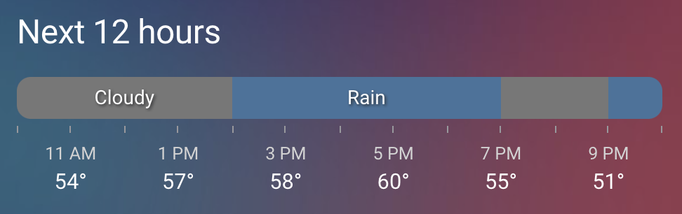

# Hourly Weather Card by [@decompil3d](https://www.github.com/decompil3d)

An hourly weather card for Home Assistant. Visualize upcoming weather conditions as a colored horizontal bar.

[![GitHub Release][releases-shield]][releases]
[![License][license-shield]](LICENSE)
[](https://github.com/hacs/integration)

![Project Maintenance][maintenance-shield]
[![GitHub Activity][commits-shield]][commits]

[](https://dashboard.cypress.io/projects/o468vw/runs)



## Installation

### Easiest method:

✨ Install via HACS

[](https://my.home-assistant.io/redirect/hacs_repository/?owner=decompil3d&repository=lovelace-hourly-weather)

### Alternative method:

1. Download `hourly-weather.js` from the [Releases][releases] page
2. Upload to `/www/hourly-weather/hourly-weather.js` (via Samba, File Editor, SSH, etc.)
3. Visit the Resources page in your Home Assistant install and add `/hourly-weather/hourly-weather.js` as a
   JavaScript Module.
   [](https://my.home-assistant.io/redirect/lovelace_resources/)
4. Refresh your browser

## Usage

This card will show in the "Add card" modal. It has a GUI editor for configuring settings.

If you prefer YAML, here is a sample config:

```yaml
type: custom:hourly-weather
entity: weather.my_weather_entity
num_segments: 18 # optional, defaults to 12
name: Next 18 hours # optional, defaults to "Hourly Weather"
```

### Choosing the right entity

This card is focused on displaying hourly weather data. It will work with coarser- or finer-grained data, though. I've
tested with the OpenWeatherMap integration using the `onecall_hourly` mode and that works very well.

As of Home Assistant 2023.9.0, most weather integrations provide data in multiple time increments. If your weather
entity provides hourly data, the card will use that by default. Otherwise, the card will attempt to use the
finest-grained increments available, unless you have configured otherwise.

> ℹ️ NOTE: If your selected weather entity provides forecasts in increments of greater than one hour at a time, each
> segment of the bar will be for one segment, not one hour.

Prior to Home Assistant version 2023.9.0, if you already use OpenWeatherMap for daily data, you can add a second
integration of the same component for hourly -- just adjust the latitude or longitude a tiny bit (i.e. change the last
decimal by 1). Otherwise, the integration may complain of a duplicate unique ID.

## Options

| Name                             | Type                   | Requirement  | Description                                                                                                                                                     | Default             |
|----------------------------------|------------------------|--------------|-----------------------------------------------------------------------------------------------------------------------------------------------------------------|---------------------|
| `type`                           | string                 | **Required** | `custom:hourly-weather`                                                                                                                                         |                     |
| `entity`                         | string                 | **Required** | Home Assistant weather entity ID.                                                                                                                               |                     |
| `forecast_type`                  | string                 | **Optional** | The type of forecast data to use. One of `hourly`, `daily`, or `twice-daily`. If not specified, the card will attempt to use the finest-grained data available. |                     |
| `name`                           | string                 | **Optional** | Card name (set to `null` to hide)                                                                                                                               | `Hourly Weather`    |
| `icons`                          | bool                   | **Optional** | Whether to show icons instead of text labels                                                                                                                    | `false`             |
| `num_segments`                   | number                 | **Optional** | Number of forecast segments to show (integer >= 1)                                                                                                              | `12`                |
| ~~`num_hours`~~                  | number                 | **Optional** | _Deprecated:_ Use `num_segments` instead                                                                                                                        | `12`                |
| `offset`                         | number                 | **Optional** | Number of forecast segments to offset from start                                                                                                                | `0`                 |
| `label_spacing`                  | number                 | **Optional** | Space between time/temperature labels (integer >= 1)                                                                                                            | `2`                 |
| `colors`                         | [object][color]        | **Optional** | Set colors for all or some conditions                                                                                                                           |                     |
| `hide_hours`                     | bool                   | **Optional** | Whether to hide hour labels under the bar                                                                                                                       | `false`             |
| `hide_temperatures`              | bool                   | **Optional** | Whether to hide temperatures under the bar                                                                                                                      | `false`             |
| `round_temperatures`             | bool                   | **Optional** | Whether to round temperatures to the nearest whole number                                                                                                       | `false`             |
| `hide_bar`                       | bool                   | **Optional** | Whether to hide the bar itself                                                                                                                                  | `false`             |
| `icon_fill`                      | [Icon Fill][icon_fill] | **Optional** | Whether to repeat the icon inside the bar                                                                                                                       | `'single`           |
| `show_wind`                      | [Wind][wind]           | **Optional** | Whether to show wind speed and/or direction under the bar                                                                                                       | `'false'`           |
| `show_precipitation_amounts`     | bool                   | **Optional** | Whether to show precipitation (rain) amount under the bar                                                                                                       | `false`             |
| `show_precipitation_probability` | bool                   | **Optional** | Whether to show precipitation (rain) probability under the bar                                                                                                  | `false`             |
| `show_date`                      | [string][dates]        | **Optional** | Whether to show date under the bar                                                                                                                              | `'false'`           |
| `tap_action`                     | [object][action]       | **Optional** | Action to take on tap                                                                                                                                           | `action: more-info` |
| `hold_action`                    | [object][action]       | **Optional** | Action to take on hold                                                                                                                                          | `none`              |
| `double_tap_action`              | [object][action]       | **Optional** | Action to take on double tap                                                                                                                                    | `none`              |
| `language`                       | string                 | **Optional** | Language to use for card (overrides HA & user settings)                                                                                                         |                     |

> Note that some of the more advanced options are not available in the card editor UI and must be configured via YAML.

### Templating

The following options allow Home Assistant Jinja templates as values:

- `name`
- `num_segments`
- `offset`
- `label_spacing`

You may use any valid template expression that produces a string or number. For example, you can define offset based on
the current time of day so that you see the next day's weather:

```yaml
name: Tomorrow
num_segments: 24
offset: |
  {{ 24 - now().hour }}
label_spacing: 4
```

Or maybe show the rest of today's weather:

```yaml
name: Today
num_segments: |
  {{ 24 - now().hour }}
label_spacing: |
  
  {{ 4 if segments > 12 else 2 }}
```

## Action Options

| Name              | Type   | Requirement  | Description                                                                                        | Default     |
|-------------------|--------|--------------|----------------------------------------------------------------------------------------------------|-------------|
| `action`          | string | **Required** | Action to perform (more-info, toggle, call-service, navigate url, none)                            | `more-info` |
| `navigation_path` | string | **Optional** | Path to navigate to (e.g. /lovelace/0/) when action defined as navigate                            | `none`      |
| `url`             | string | **Optional** | URL to open on click when action is url. The URL will open in a new tab                            | `none`      |
| `service`         | string | **Optional** | Service to call (e.g. media_player.media_play_pause) when action defined as call-service           | `none`      |
| `service_data`    | object | **Optional** | Service data to include (e.g. entity_id: media_player.bedroom) when action defined as call-service | `none`      |
| `haptic`          | string | **Optional** | Haptic feedback _success, warning, failure, light, medium, heavy, selection_                       | `none`      |
| `repeat`          | number | **Optional** | How often to repeat the `hold_action` in milliseconds.                                             | `none`      |

## Color Options

`colors` is specified as an object containing one or more of the keys listed below and values that are valid CSS
colors or objects of foreground and/or background valid CSS colors. Invalid color values will be discarded and will
trigger a warning.

### Color value format

Colors may be specified as a valid CSS color string or as an object with one or more of the following fields, each
containing a valid CSS color string:

- `foreground`: The color of the condition label text or icon
- `background`: The color of the bar background during that span

If color is specified as a plain string, it will be used for background. Foreground color defaults to the primary text
color in your Home Assistant theme.

Some conditions will default to whatever the value is of some other condition. For example, `fog` will default to
whatever `cloudy` is.

| Key               | Default                |
|-------------------|------------------------|
| `clear-night`     | `#000`                 |
| `cloudy`          | `#777`                 |
| `fog`             | same as `cloudy`       |
| `hail`            | `#2b5174`              |
| `lightning`       | same as `rainy`        |
| `lightning-rainy` | same as `rainy`        |
| `partlycloudy`    | `#b3dbff`              |
| `pouring`         | same as `rainy`        |
| `rainy`           | `#44739d`              |
| `snowy`           | `#fff`                 |
| `snowy-rainy`     | same as `partlycloudy` |
| `sunny`           | `#90cbff`              |
| `windy`           | same as `sunny`        |
| `windy-variant`   | same as `sunny`        |
| `exceptional`     | `#ff9d00`              |

### Sample colors configuration

```yaml
colors:
  sunny: '#bbccee' # note that hex colors must be quoted
  snowy-rainy: rgba(255, 255, 255, 0.8) # rgba works (and hsla too)
  exceptional: red # as do valid CSS color names
  windy:
    background: lightgray
    foreground: '#000'
```

### Wind Options

`show_wind` can be one of the following values:

- `false` Don't show wind speed/direction (default)
- `true` Show both wind speed and direction
- `speed` Only show wind speed
- `direction` Only show wind direction
- `barb` Show wind direction as a wind barb arrow
- `barb-and-direction` Show wind direction as a wind barb arrow and also show textual direction
- `barb-and-speed` Show wind direction as a wind barb arrow and also show speed
- `barb-speed-and-direction` Show wind direction as a wind barb arrow and also show speed and textual direction

> Note: If your weather entity uses cardinal directions (e.g. 'N', 'SW', etc.) rather than numeric degrees for
> `wind_bearing`, the `barb` option is not supported and will result in an error.

### Date Options

`show_date` can be one of the following values:

- `false` Don't show date (default)
- `boundary` Show date at the boundary between days
- `all` Always show date

### Icon Fill Options

`icon_fill` can be one of the following values:

- `single` Show one icon per forecast span (default)
- `full` Show one icon per forecast segment.
- `<n>` (an integer). Show icons every _n-th_ forecast segment (will show at least one icon per forecast span)

> **NOTE:** If a forecast segment is not wide enough to fit an icon, the icon will not be shown. That means that on
> narrow screens or with many segments, you may not see all icons. If that happens, consider using a larger numeric
> value for `icon_fill` or use `single` to show one icon per forecast span.

## Upgrades

### Version 3 ➡️ 4

In version 4.x, the `num_hours` option was deprecated in favor of `num_segments`. This simplifies the card and makes it
clear that it operates on whatever size forecast segment your entity provides. The `num_hours` option still works, but
`num_segments` takes precedence, if set. `num_hours` will be removed in a later major version of the card.

### Version 4 ➡️ 5

In version 5.x, the DOM structure of the weather bar and its labels was changed to allow for odd-numbered segment
counts and label spacing. Labels now appear centered with the segment they are representing, and the first label shown
on the bar represents the first segment of data where in prior versions labels would begin at the second segment. This
change may cause some custom CSS to break. If you have custom CSS, you may need to adjust it to account for the new
structure.

[commits-shield]: https://img.shields.io/github/commit-activity/y/decompil3d/lovelace-hourly-weather.svg?style=for-the-badge
[commits]: https://github.com/decompil3d/lovelace-hourly-weather/commits/main
[devcontainer]: https://code.visualstudio.com/docs/remote/containers
[license-shield]: https://img.shields.io/github/license/decompil3d/lovelace-hourly-weather.svg?style=for-the-badge
[maintenance-shield]: https://img.shields.io/maintenance/yes/2024.svg?style=for-the-badge
[releases-shield]: https://img.shields.io/github/release/decompil3d/lovelace-hourly-weather.svg?style=for-the-badge
[releases]: https://github.com/decompil3d/lovelace-hourly-weather/releases

[color]: #color-options
[wind]: #wind-options
[icon_fill]: #icon-fill-options
[dates]: #date-options
[action]: #action-options
